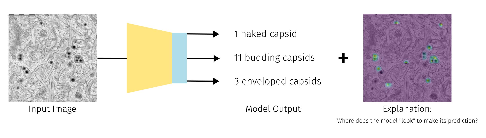

# Deep-EM Playground: Bringing Deep Learning to Electron Microscopy Labs

This codebase is part of the Deep-EM Playground. For more details, please see our [webpage](https://viscom-ulm.github.io/DeepEM/).

## Image to Value(s)

### Primary Focus: Explainable Object Counting in Microscopy Images
### Application: Explainable Virus Capsid Quantification
#### Challenge: Deep Learning as Black Box
#### Required Labels: Location Labels

TL;DR 🧬✨ We developed a regression model to quantify virus capsids and their mutation stages ("naked" 🩲, "budding" 🌱, "enveloped" 📦) during secondary envelopment in TEM images. Researchers can adapt the provided notebook within the primary focus area for their own EM data analysis (i.e. counting midrochondia).

## Citation

If you find this code useful, please cite us: 

    @inproceedings{
    }